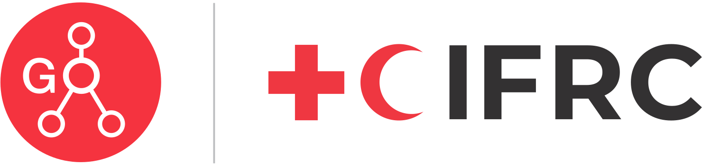

<p align="center">
  <br />
  <a href="https://go.ifrc.org/">
    <picture>
      
    </picture>
  </a>
</p>

## IFRC GO

[IFRC GO](https://go.ifrc.org/) is the platform of the Red Cross Red Crescent, aimed at connecting crucial information on emergency needs with the appropriate response. This repository houses the frontend source code for the application, developed using [React](https://react.dev/), [Vite](https://vitejs.dev/), and associated technologies.

## Built with

 [![React][react-shields]][react-url] [![Vite][vite-shields]][vite-url] [![Typescript][typescript-shields]][typescript-url]

## Getting started

Below are the steps to guide you through preparing your local environment for the IFRC GO Web application development. The repository is set up as a [monorepo](https://monorepo.tools/). The app directory houses the application code, while the packages directory contains related packages, including the [IFRC GO UI](https://www.npmjs.com/package/@ifrc-go/ui) components library.

### Prerequisites

To begin, ensure you have network access. Then, you'll need the following:
1. [Git](https://git-scm.com/)
2. [Node.JS](https://nodejs.org/en/) version >=18 / 20+
3. [Yarn 1](https://classic.yarnpkg.com/en/)
4. Alternatively, you can use [Docker](https://www.docker.com/) to build the application.

### Local development

1. Clone the repository using HTTPS, SSH, or Github CLI
```bash
git clone https://github.com/IFRCGo/go-web-app.git #HTTPS
git clone git@github.com:IFRCGo/go-web-app.git #SSH
gh repo clone IFRCGo/go-web-app #Github CLI
```
2. Install the dependencies
```bash
yarn install
```
3. Copy `app/.env.example` to `app/.env` and update the variables
```bash
cp app/.env.example app/.env
```
4. Start the development server
```bash
yarn start:app
```

### Build for production

1. To build the application for production
```bash
yarn build
```
2. To locally preview the production build
```bash
yarn preview
```
## Additional packages

The repository hosts multiple packages under `packages` directory.
 1. [IFRC GO UI](https://www.npmjs.com/package/@ifrc-go/ui) is a React UI components library tailored to meet the specific requirements of the IFRC GO community and its associated projects.
 2. [IFRC GO UI Storybook](https://github.com/IFRCGo/go-web-app/tree/develop/packages/go-ui-storybook) serves as the comprehensive showcase for the components library.

## IFRC GO backend

The backend that serves the frontend application is maintained in a separate [repository](https://github.com/IFRCGo/go-api/).

## Community & support

- Visit the [IFRC GO Wiki](https://go-wiki.ifrc.org/) for documentation of the IFRC GO platform.
- Create [GitHub Issues](https://github.com/IFRCGo/go-web-app/issues) for bug reports and feature requests.
- Tweet at [@ifrcgo](https://twitter.com/ifrcgo) on Twitter.
- Stay informed about the latest project updates at [Medium](https://ifrcgoproject.medium.com/).

## Contributing

Have a look through existing [Issues](https://github.com/IFRCGo/go-web-app/issues) and [Pull Requests](https://github.com/IFRCGo/go-web-app/pulls) that you could help with. If you'd like to request a feature or report a bug, please [create a GitHub Issue](https://github.com/IFRCGo/go-web-app/pulls) using one of the templates provided.

[See contribution guide →](https://github.com/IFRCGo/go-web-app/blob/develop/CONTRIBUTING.md)

## License

[MIT](https://github.com/IFRCGo/go-web-app/blob/develop/LICENSE)

<!-- MARKDOWN LINKS & IMAGES -->
<!-- https://www.markdownguide.org/basic-syntax/#reference-style-links -->
[react-shields]: https://img.shields.io/badge/react-%2320232a.svg?style=for-the-badge&logo=react&logoColor=%2361DAFB
[react-url]: https://reactjs.org/
[vite-shields]: https://img.shields.io/badge/vite-%23646CFF.svg?style=for-the-badge&logo=vite&logoColor=white
[vite-url]: https://vitejs.dev/
[typescript-shields]: https://img.shields.io/badge/typescript-%23007ACC.svg?style=for-the-badge&logo=typescript&logoColor=white
[typescript-url]: https://www.typescriptlang.org/
